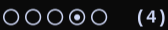

niri-workspace-column-indicator
===============================

A Niri workspace-column-indicator (for Waybar). Displays which column in a workspace has focus.

It prints to standard output.

For example, here a tiled window on column 4 has focus:

<div></div>


Installation
------------

Requires "Fontawesome icons" to print the symbol characters, for example the icons in the "Fira Code Nerd" font.

Requires [Rust](https://www.rust-lang.org/) to build.

To build and install, for example, in folder ~/.local/bin (in $PATH), run:

    $ cargo install --git=https://github.com/willemw12/niri-workspace-column-indicator.git --no-track --root=$HOME/.local

Or the same, but download separately:

    $ git clone https://github.com/willemw12/niri-workspace-column-indicator.git
    $ cargo install --no-track --path=./niri-workspace-column-indicator --root=$HOME/.local

Or build and then copy the program to the standard Waybar scripts folder (outside $PATH):

    $ cargo build --release
    $ mkdir -p ~/.config/waybar/scripts
    $ cp -a target/release/niri-workspace-column-indicator ~/.config/waybar/scripts/


Configuration
-------------

Here is a custom Waybar module configuration example in file ~/.config/waybar/config:

```
"modules-left": ["niri/workspaces", "custom/niri-columns"],
"custom/niri-columns": {
    "exec": "niri-workspace-column-indicator",
    // "exec": "~/.config/waybar/scripts/niri-workspace-column-indicator",
    "return-type": "text",
    "format": "            {}",
    "tooltip": false
},
```


Alternative
-----------

File [`./extra/niri-workspace-column-indicator.sh`](./extra/niri-workspace-column-indicator.sh) does the same as the Rust program but is written in Bash.


License
-------

GPL-3.0-or-later


Link
----

[GitHub](https://github.com/willemw12/niri-workspace-column-indicator)
